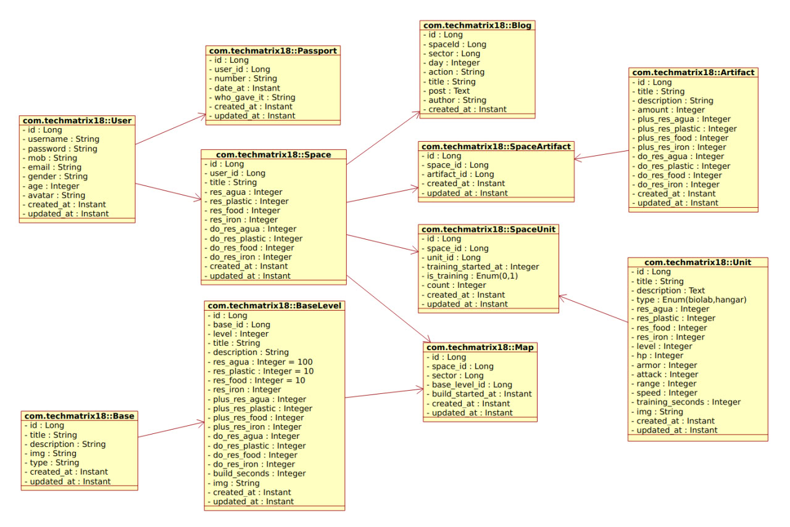
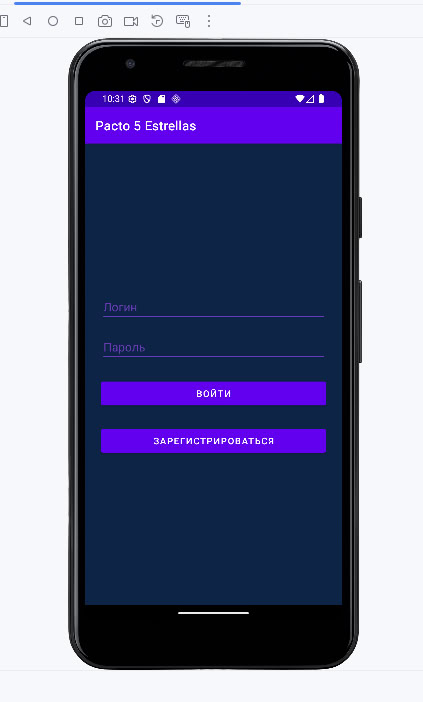

# El proyecto: android-studio-app-from-zero

Yo como Arquitectador =) pinté esta eschema UML para mejor entender el proyecto con sus tablas

en base de datos.

Varios pantillas del proyecto bajo

    

### En Postman

Pronto será más... 